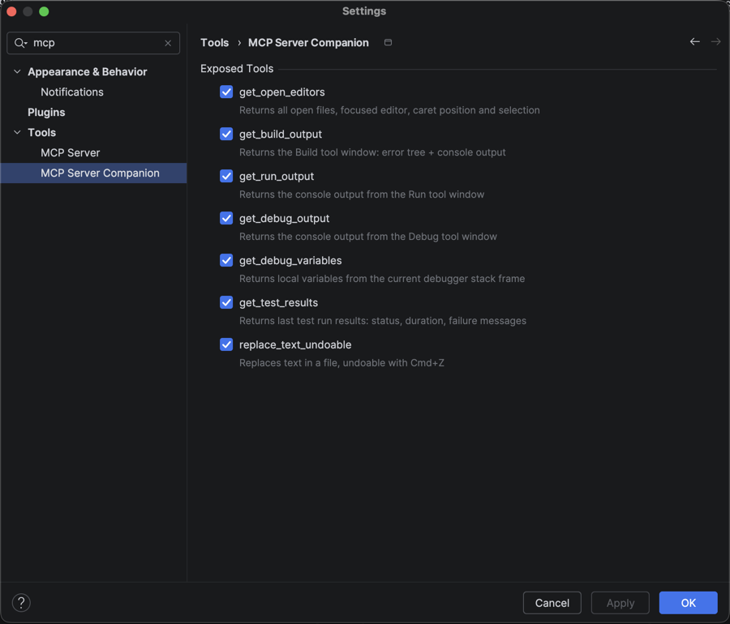

# MCP Server Companion

An IntelliJ IDEA plugin that extends the built-in [JetBrains MCP Server](https://plugins.jetbrains.com/plugin/26071-mcp-server) with additional tools for AI clients (Claude, Cursor, etc.).

## Requirements

- IntelliJ IDEA 2024.3+
- [MCP Server plugin](https://plugins.jetbrains.com/plugin/26071-mcp-server) installed
- An AI client configured with `@jetbrains/mcp-proxy` (Claude Desktop, Cursor, etc.)

## Tools

| Tool | Description |
|------|-------------|
| `get_mcp_companion_overview` | Describes all available MCP Companion tools and how to use them |
| `get_open_editors` | Open files, focused editor, caret position, and current text selection |
| `navigate_to` | Opens a file and places the cursor at a given line and column |
| `select_text` | Opens a file and selects a text range |
| `highlight_text` | Highlights multiple zones in a file using the IDE's search-result color |
| `clear_highlights` | Removes all highlights added by `highlight_text` |
| `get_build_output` | Build tool window: structured error tree with file/line numbers + console text |
| `get_run_output` | Console output from the Run tool window |
| `get_test_results` | Last test run results: passed/failed/ignored status, duration, and failure messages |
| `debug_run_configuration` | Launches a run configuration in debug mode |
| `get_debug_output` | Console output from the Debug tool window |
| `get_debug_variables` | Local variables and values from the current debugger stack frame |
| `get_breakpoints` | Lists all line breakpoints with file, line, enabled state, and condition |
| `add_conditional_breakpoint` | Adds a breakpoint with an optional condition expression |
| `set_breakpoint_condition` | Sets or removes a condition on an existing breakpoint |
| `mute_breakpoints` | Mutes or unmutes all breakpoints in the active debug session |
| `get_project_structure` | Returns SDK, modules, source roots, excluded folders, and module dependencies |
| `get_intellij_diagnostic` | One-call diagnostic: indexing status, notifications, running processes, and idea.log WARN/ERROR tail |
| `get_running_processes` | Lists active and paused background processes in IntelliJ |
| `manage_process` | Pauses, resumes, or cancels a background process by title |
| `replace_text_undoable` | Replace text in a file via IntelliJ's document API (supports Cmd+Z undo) |
| `delete_file` | Deletes a file from the project (undoable) |

## Settings

Each tool can be individually enabled or disabled in **Settings → Tools → MCP Server Companion**.



## Example prompts

**Editor**
- *"What file am I currently editing, and what line is my cursor on?"*
- *"Look at the file I'm editing and suggest improvements for the selected code."*

**Build**
- *"Check my build output and tell me what errors I have."*
- *"Run a build, check the result, and fix any errors."*
- *"I have a build error — can you identify the cause and fix it? Make it undoable."*

**Run & Debug**
- *"Run the program and show me the output."*
- *"What are the current variable values at this breakpoint?"*
- *"Set a breakpoint at line 13, launch debug, and stop when i=3."*

**Tests**
- *"Run the tests and tell me which ones failed and why."*
- *"Fix the failing tests."*

## Setup

### 1. Install the MCP Server plugin

Install [MCP Server](https://plugins.jetbrains.com/plugin/26071-mcp-server) from the JetBrains Marketplace.

### 2. Build and install this plugin

```bash
git clone https://github.com/maximehamm/mcp-intellij-all.git
cd mcp-intellij-all
./gradlew buildPlugin
```

Then install the plugin from `build/distributions/` via **Settings → Plugins → Install Plugin from Disk**.

### 3. Configure your AI client

Add the JetBrains MCP proxy to your AI client config (e.g. `claude_desktop_config.json`):

```json
{
  "mcpServers": {
    "jetbrains": {
      "command": "npx",
      "args": ["-y", "@jetbrains/mcp-proxy"]
    }
  }
}
```

## Development

```bash
./gradlew runIde   # Launch a sandbox IntelliJ with the plugin
./gradlew buildPlugin  # Build the distributable .zip
```

## License

MIT
